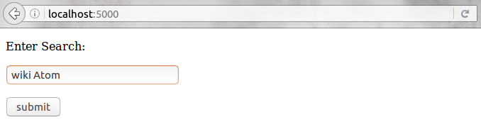

# flash-experiment
###### This repo is an experiment to learn about Flask and Wikipedia API. Author: @csbenk

## Below are the steps to follow to run the above code.
1. First of all install the requirements:
  ```
  sudo pip install -r requirements.txt
  ```
2. Next step is to run the python file.
  ```
  python test.py
  ```
3. When you run the py code, you get something like this
 <br/>
   Note the address, this is what you must enter in your browser.
4. When you enter the address in your browser, you get a search tab like this 
 <br/>
   Here, you can enter your search by typing "wiki" followed by you *query*.

## Note:
You need to have **Python** and python package manager **pip** installed. 
* Please go to the [Link](https://www.python.org/) to download **Python**. 
* This [Link](https://pip.pypa.io/en/stable/installing/) is to install **pip**

## Wiki
The above program is simple implementation to learn about the power and simplicity of **Flask** library. I have also used **Wikipedia** API too, this is a very simple API to use. I have written this code to learn the basics only. 
